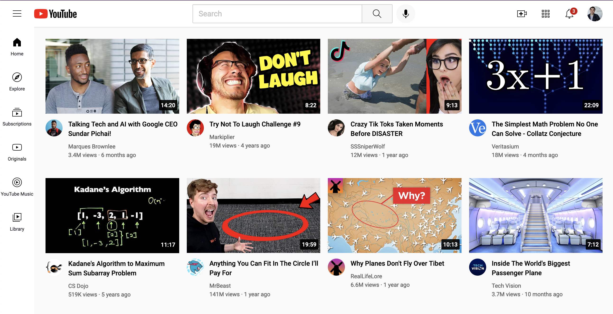

# YouTube_Clone
Static YouTube Page

# Frontend Mentor - Product preview card component

## Welcome! 👋

This is my project solution which was gotten from https://supersimple.dev/exercises/youtube.

[Frontend Mentor](https://supersimple.dev/exercises/youtube) challenges help you improve your coding skills by building realistic projects.

**To do this challenge, you need a basic understanding of HTML and CSS.**

## The challenge

My challenge is to build out this YouTube clone component and get it looking as close to the design as possible.

I can use any tools you like to help you complete the challenge. So if you've got something you'd like to practice, feel free to give it a go.

Your users should be able to:

- View the optimal layout depending on their device's screen size
- See hover and focus states for interactive elements
